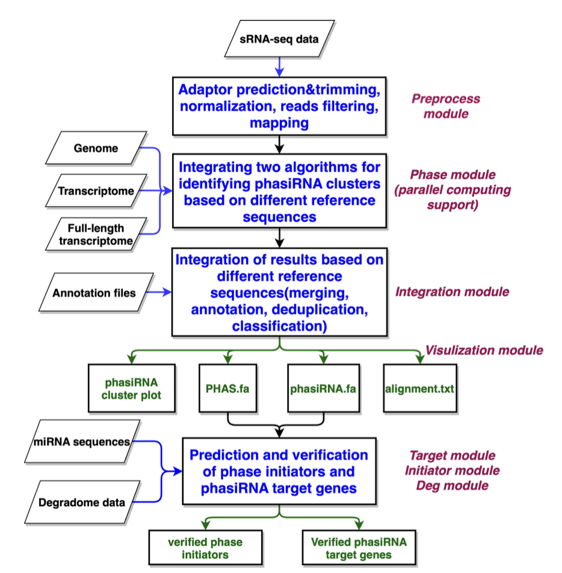
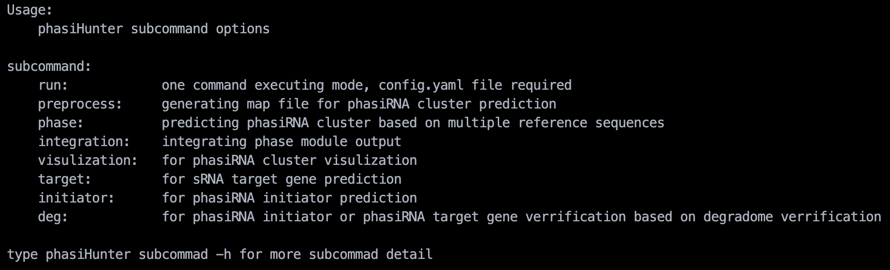

# Index
- [Index](#index)
- [User guide](#user-guide)
  - [PhasiHunter workflow](#phasihunter-workflow)
  - [Dependencies](#dependencies)
  - [Installation](#installation)
  - [Executing PhasiHunter with step-by-step submodules.](#executing-phasihunter-with-step-by-step-submodules)
  - [Executing PhasiHunter with one-command module](#executing-phasihunter-with-one-command-module)
    - [Default config.yaml file](#default-configyaml-file)
    - [The main output file](#the-main-output-file)
- [Copyright](#copyright)


# User guide
Welcome to phasihunter 😉

A multithreaded program for mining phasiRNA regulation pathways based on multiple reference sequences.

## PhasiHunter workflow


## Dependencies
phasihunter is a CLI program runing on linux platform. The correction runing of phasihunter depends on some existing softwares.
- Bowtie (Langmead, et al., 2009. Genome Biol)
- Biopython (Cock, et al., 2009. Bioinformatics)
- Bedtools (Quinlan and Hall, 2010. Bioinformatics)
- Dnapi (Tsuji and Weng, 2016. PloS One)
- Trim_galore (https://github.com/FelixKrueger/TrimGalore)
- Seqkit (Shen, et al., 2016. PloS One)
- Perl5 (https://www.perl.org)
- Fasta36 (Pearson and Lipman, 1988. Proc Natl Acad Sci U S A)
- TarHunter (Ma, et al., 2018. Bioinformatics)

```sh
# Bowtie, Biopython, Bedtools, Trim_galore, Seqkit can install with conda conveniently.
conda insatll bowtie biopython bedtools trim-galore, seqkit -c conda-forge -c bioconda -n <your conda env name>

# Dnapi and TarHunter also include in PhasiHunter. Users do not need to download them separately

# Fasta36 provied binary package, user can download from github website
wget -c https://github.com/wrpearson/fasta36/releases/download/v36.3.8i_14-Nov-2020/fasta-36.3.8i-linux64.tar.gz
tar -xzvf fasta-36.3.8i-linux64.tar.gz 
cd fasta-36.3.8i/bin
echo "export PATH=\$PATH:$PWD >> ~/.bashrc"

# perl5 is pre-installed software in most unix distributions
```

## Installation
1. Clone phasihunter

    `git clone https://github.com/HuangLab-CBI/PhasiHunter.git .`

2. Setting enviroment variable in ~/.bashrc

    `echo "export PATH=\$PATH:<phasihunter PATH> >> ~/.bashrc"`

    example:
    
    `echo "export PATH=\$PATH:/home/user/volumes/PhasiHunter >> ~/.bashrc"`

3. type `phasihunter -h` to check phasihunter whether installation correct. If phasiHunter is installed correctly you will see the following content.

    

## Executing PhasiHunter with step-by-step submodules. 
Parameter in < > means necessary; parameter in [ ] means optional

1. Data pre-process
```bash
phasiHunter preprocess -m <r> -i <SRR5049781.fastq.gz> -r <oryza_sativa_cdna.fa> -o [SRR5049781_cdna.map]

phasiHunter preprocess -m <r> -i <SRR5049781.fastq.gz> -r <oryza_sativa_gdna.fa> -o [SRR5049781_gdna.map]
```

- preprocess module usage

```txt
Help messeage:
  options: 
    # necessary options:
    -m:  string --  mode: r | c | m;
                    raw(mode): trim adaptor --> normalization --> length and abundance filter --> mapping
                    clean(mode): normalization --> length and abundance filter --> mapping
                    mapping(mode): mapping
    -i:  file   --  for r mode: fastq file or fastq.gz file
                    for c mode: fasta file or fasta.gz file
                    for m mode: length and abundance filter fasta file
    -r:  file   --  reference sequence fasta file
    -in: string --  index prefix, -r option will be ignored when -in enable
    -o:  outfile --  outfile name

    # options with default value
    -j:  int    --  adaptor trim parallel cores; <8 is recommend, only need in r mode, default=1
    -bj: int    --  bowtie parallel cores; defalut=1
    -mh: int    --  max hits when mapping to ref sequence, default=10
    -mi: int    --  minimal sRNA reads length cutoff, default=19
    -ma: int    --  maxmial sRNA reads length cutoff, default=25
    -e:  float  --  sRNA reads cpm cutoff, default=1 
    -n:  int    --  normalization base, default=1000000


    # other
    -v:         --  print version information
    -h:         --  print help information
```

2. PhasiRNA and PHAS loci prediction
```bash 
phasiHunter phase -cm <SRR5049781_cdna.map> -c <oryza_sativa_cdna.fa> -gm <SRR5049781_gdna.map> -g <oryza_sativa_gdna.fa> -fa <SRR7851621_trimmed_format_filter.fa> -a [SRR5049781_allsiRNA.txt] -o [SRR5049781_phasiRNA.txt] -pl [21] -j [10] -pv [0.0001] -ps [15] -pr [0.4] 
```
- phase module usage
```txt
phase usage:
  option:
    -cm: file  --  map file based on reference transcriptome sequence
    -c:  file  --  reference transcritome sequence, fasta file
    -gm: file  --  map file based on reference genome sequence
    -g:  file  --  reference genome sequence, fasta file
    -fm: file  --  map file based on full length transcriptome sequence
    -f:  file  --  full length transcriptome sequence, fasta file
    -fa: file  --  sRNA file
    -a:  out   --  allsiRNA cluster output file, default name is phase_a.txt
    -o:  out   --  phasiRNA cluster output file, default name is phase_o.txt
    -me: str   --  phasiRNA prediction method, h(hypergeometric test) | p(phase score) | b (both), default=b
    -il: int   --  phasiRNA cluster island, default=5
    -pl: int   --  phase length, 21 | 24, default=21
    -pn: int   --  phase number, default=4
    -mh: int   --  max hits when mapping to ref sequence, default=10
    -j:  int   --  parallel number, default=1
    -pv: float --  pvalue cutoff, default=0.001, only function with h/b method applied
    -ps: float --  phase score cutoff, default=15, only function with p/b method applied
    -pr: float --  phase ratio cutoff, default=0.4, only function with p/b method applied
    -cl: str   --  delete .phasiHuter_bowtieIndex, y|n, default=y
    -v:        --  print version information
    -h:        --  print help information
```

3. PhasiRNA and PHAS loci result integration
```bash
phasiHunter integration -io <SRR5049781_phasiRNA.txt> -ia <SRR5049781_allsiRNA.txt> -an <oryza_sativa_gdna.gff3> -o [SRR5049781_phasiRNA_dup.txt] -a [SRR5049781_allsiRNA_dup.txt] -s [SRR5049781_summary.txt] -po [SRR5049781_phas.txt] -g <y>
```
- integration module usage
```txt
integration usage:
  option:
    # necessary options:
    -io: file  --  phase module -o output file
    -ia: file  --  phase module -a output file
    -an: file  --  reference genome gff3 file
    -g:  str  --  y | n, whether exist gdna based PHAS loci

    # options with default value
    -o:  out  --  integration phasiRNA cluster, default name is integration_o.txt
    -a:  out  --  integration all siRNA cluster, default name is integration_a.txt
    -s:  out  --  integration summary, default name is integration_s.txt
    -po: out  --  PHAS loci information, default name is integration_p.txt
    -j:  int   --  parallel number, default=1
    -pn: int   --  phase number, default=4
    -pl: int   --  phase length, 21 | 24, default=21
    -pv: float --  pvalue cutoff, default=0.001
    -il: int   --  phasiRNA cluster island, default=5
    -dp: str   -- y | n, discard only P method result, default=y

    # optional options
    -fn: file  --  full length transcript annotation file

    # other
    -v:       --  print version information
    -h:       --  print help information
```

4. Print phasiRNA_cluster plot, phasiRNA.fa, PHAS.fa
```bash
phasiHunter visulization -io <SRR5049781_phasiRNA_dup.txt> -ia <SRR5049781_allsiRNA_dup.txt> -ip <SRR5049781_phas.txt> -a [SRR5049781_alignment.txt] -o [SRR5049781.phasiRNA.fa] -p [SRR5049781.PHAS.fa] -c [oryza_sativa_cdna.fa] -g [oryza_sativa_gdna.fa] -pc [y] -pg [y]
```
- visulization module usage
```txt
visulization usage:
  option:
    # necessary options:
    -io: file  --  integration -io outputfile
    -ia: file  --  integration -ia outputfile
    -ip: file  --  integration -po outputfile
    -a:  out   --  alignment file, default name is alignment.txt
    -o:  out   --  phasiRNA fasta file, default name is phasiRNA.fa
    -p:  out   --  PHAS Gene fasta file; Format: >geneid/chr\tphasiRNA_cluster_region(start end)\tseq_region(start end), default name is PHAS.fa

    # options with default value
    -pl: int   --  phase length, 21 | 24, default=21
    -m:  float  --  the number for reducing the size of Y-axis. default=10

    # optional options
    -c:  file  --  reference transcritome sequence, fasta file, enable cdna based phasiRNA.fa, PHAS.fa, Alignmen, Plot output
    -g:  file  --  reference genome sequence, fasta file, enable gdna based phasiRNA.fa, PHAS.fa, Alignmen, Plot output
    -f:  file  --  full length transcriptome sequence, fasta file, enable flnc based phasiRNA.fa, PHAS.fa, Alignmen, Plot output
    -pc: str  --  plot cdna based phasiRNA cluster, y | n, defaut=y
    -pg: str  --  plot gdna based phasiRNA cluster, y | n, defaut=y
    -pf: str  --  plot flnc based phasiRNA cluster, y | n, defaut=y

    # other
    -v:        --  print version information
    -h:        --  print help information
```

5. Initiator prediction and verification
```bash 
phasiHunter target -q <osa_miRNA.fa> -b <SRR5049781_PHAS.fa> -o <SRR5049781_miR.txt> -t

phasiHunter initiator -i <SRR5049781_phasiRNA_dup.txt> -j <SRR5049781_miR.txt> -ip <SRR5049781_phas.txt> -o <SRR5049781_initiator.txt>

phasiHunter deg -i <degradome_PHAS.map> -q <osa_miRNA.fa> -j <SRR5049781_initiator.txt> -t <SRR5049781_PHAS.fa> -o <SRR5049781_initiator_verified.txt> -in <y>
```

- target module usage
```txt
Usage:
    perl /home/user/volumes/PhasiHunter/bin/TarHunterL_Modified.pl -q <mir_file> -b <targ_file> -o <out_file> [Options]

Required arguments:
    -q (--qmir):         query miRNA file
    -b (--targ):         target file
    -o (--output):       output file

Options:

    -M (--total_misp):   max. total mispairs               [Default: off]
    -m (--seed_misp):    max. seed mispairs                [Default: off]
    -f (--score):        score cutoff                      [Default:  4 ]

    -I (--mimics):       eTM search                        [Default: off]
    -i (--mimics_str):   eTM stringency
                        (0: strict, 1: relaxed)           [Default:  0 ]

    -T (--threads):      FASTA threads                     [Default:  1 ]
    -t (--tab):          tabular format output             [Default: off]
    -h (--help):         help information

Dependencies:
    fasta36    
```

- initiator module usage
```txt
initiator option:
  -i  [str]integration -o output
  -j  [str]the target predicted by psRNAtarget server or target module
  -ip [str]integration -po output
  -pd [int]the microRNA distance away to phase border, default=105(21) or 120 (24), optional
  -pl [int]21 or 24, the phase length of 21 or 24, default=21
  -ps [int]0 or 1, the position of cleavage at 10(0) or 9-11 (1), default=1
  -o  [str]outputfilename.
  -h  print the version and details of the usage
```

- deg module usage
```txt
// function: vertified the sRNA - Target interaction with degradome data

  options:
  -i: <inputfilename>     --    mapping file for degradome data mapping transcripts, by bowtie
  -q: <sRNA fasta>        --    small RNA sequences used for target prediction, fasta
  -j: <inputfilename>     --    from psRNATarget batch download file or initiator output
  -t: <inputfilename>     --    transcripts file, fasta
  -o: <outputfilename>    --    matched map file with only matched records
  -s: <shift_number>      --    if shifts=0 then cleaved exactly at pos.10, default=1
  -m: <minum deg_num>     --    minum number of degradome reads, int, default=0
  -p: <T-plot function>   --    enable the plot function, y | n, default='n' 
  -in: <bool>             --    y | n, use initiator output information
  -pl [int]               --    1,plot only category 1; 2, plot categories 1 and 2, default=1
  -pf [str]               --    output folder name, for exporting t-plot images and outputfile
  --lib [str]             --    library name
  -less                   --    only output cat_1 and cat_2 information

  ***********************
  //About the categories:
  Cat #1, degradome read at the cleavage site is most abundant.
  Cat #2, the read is less than the most abudant one, but higher than the median.
  Cat #3, the read is less than the median, but high than 1
  Cat #4, the read is identical or less than 1 (if degradome data is normalized)
```

6. PhasiRNA target prediction and verification
```bash
phasiHunter target -q <SRR5049781_phasiRNA.fa> -t <oryza_sativa_cdna.fa> -o <SRR5049781_phasiRNA_target.txt>

phasiHunter deg -i <degradome_cdna.map> -q <SRR5049781_phasiRNA.fa> -j <SRR5049781_phasiRNA_target.txt> -t <oryza_sativa_cdna.fa> -o <SRR5049781_phasiRNA_target_verified.txt> -in <n>
```

## Executing PhasiHunter with one-command module
**One-command module usage**
```txt
One command executing mode

Usage: 
    phasiHunter run [-i] [config file]
    phasiHunter run -d

option:
    -i: yaml format config file
    -d: using the default config, defalut config file is /foo/PhasiHunter/bin/config.yaml
    -h: print help information

WARNIG: make sure choose the correct config file before run this command
```
### Default config.yaml file
**Some INPUT and OUTPUT still need modified when using.**
```yaml
# Please provide the full path to the input file

# Configure the modules that need to be run
# y means enable, n means disable
Runing_module:
  preprocess: y
  phase: y
  integration: y
  visulization: y
  initiator_prediction_and_verification:
    target: y
    initiator: y
    deg: y
  phasiRNA_target_prediction_and_verification:
    phasiRNA_target: y
    phasiRNA_deg: y

# Configure the preprocess module
preprocess:
  # raw(mode): trim adaptor --> normalization --> length and abundance filter --> mapping
  # clean(mode): normalization --> length and abundance filter --> mapping
  # mapping(mode): mapping
  mode: r # [r | c | m]

  # for r mode: fastq file or fastq.gz file
  # for c mode: fasta file or fasta.gz file
  # for m mode: length and abundance filter fasta file
  # ** INPUT ** 
  inputfile: /home/user/test_osa/SRR5049781.fastq.gz

  # reference sequence fasta file
  # ** INPUT ** 
  reference_fasta: # disable when index parameter enable, multiple sequence can provided here
    - /home/user/test_osa/oryza_sativa_cdna.fa
    - /home/user/test_osa/oryza_sativa_gdna.fa

  # index prefix, reference_fasta option will be ignored when index enable, multiple index can provided here
  # ** INPUT ** 
  index:
    - /home/user/test_osa/index/oryza_sativa_cdna_index
    - /home/user/test_osa/index/oryza_sativa_gdna_index

  # outfile name, relative path is work for outputfile, the number must be the same as the number of reference_fasta or indexe
  # ** OUTPUT ** 
  outfile_name: 
    - SRR5049781_processed_cdna.map
    - SRR5049781_processed_gdna.map

  # adaptor trim parallel cores; <8 is recommend, only need in r mode
  trim_adaptor_cores: 1

  # bowtie parallel cores
  bowtie_mapping_cores: 1

  # max hits when mapping to ref sequence
  bowtie_max_hits_cutoff: 10

  # minimal sRNA reads length cutof
  minimal_sRNA_length_cutoff: 19

  # maxmial sRNA reads length cutoff
  maxmial_sRNA_length_cutoff: 25

  # sRNA reads cpm cutoff
  sRNA_expression_cutoff: 1

  # normalization base
  library_normalization_base: 1000000


# Configure the phase module
phase:
  # map file based on reference transcriptome sequence
  # ** INPUT ** 
  mapped_cdna_file: /home/user/test_osa/SRR5049781_processed_cdna.map

  # map file based on reference genome sequence
  # ** INPUT ** 
  mapped_gdna_file: /home/user/test_osa/SRR5049781_processed_gdna.map
  
  # map file based on full length transcriptome sequence
  # ** INPUT ** 
  mapped_flnc_file:

  # reference transcritome sequence, fasta file
  # ** INPUT ** 
  cdna_fasta: /home/user/test_osa/oryza_sativa_cdna.fa

  # reference genome sequence, fasta file
  # ** INPUT ** 
  gdna_fasta: /home/user/test_osa/oryza_sativa_gdna.fa
  
  # full length transcriptome sequence, fasta file
  # ** INPUT ** 
  flnc_fasta:

  # sRNA file
  # ** INPUT ** 
  sRNA_fa: /home/user/test_osa/SRR5049781_trimmed_format_filter.fa
  
  # allsiRNA cluster output
  # ** OUTPUT ** 
  allsiRNA_cluster_output: phase_a.txt
  
  # phasiRNA cluster output file
  # ** OUTPUT ** 
  phasiRNA_cluster_output: phase_o.txt
  
  # phasiRNA prediction method, h(hypergeometric test) | p(phase score) | b (both)
  phasiRNA_prediction_method: b

  # phasiRNA cluster island
  phasiRNA_cluster_island: 5

  # phase length
  phase_length: 21
  
  # phase number
  phase_number_cutoff: 4

  # max hits when mapping to ref sequence
  bowtie_max_hits_cutoff: 10

  # parallel number
  parallel_cores: 20

  # pvalue cutoff, only function with h/b method applied
  pvalue_cutoff: 0.001

  # phase score cutoff, only function with p/b method applied
  phase_score_cutoff: 15

  # phase ratio cutoff, only function with p/b method applied
  phase_ratio_cutoff: 0.4

  # delete .phasiHuter_bowtieIndex, y|n
  delete_index: y


# Configure the integration module
integration:
  # phase module phasiRNA_cluster_output
  # ** INPUT ** 
  o_inputfile: /home/user/test_osa/phase_o.txt

  # phase module allsiRNA_cluster_output
  # ** INPUT ** 
  a_inputfile: /home/user/test_osa/phase_a.txt

  # reference genome gff3 file
  # ** INPUT ** 
  gff3: /home/user/test_osa/oryza_sativa_gdna.gff3

  # y | n, whether exist gdna based PHAS loci
  gdna_based_PHAS_loci: y

  # integration phasiRNA cluster
  # ** OUTPUT ** 
  integration_phasiRNA_cluster: integration_o.txt

  # integration all siRNA cluste
  # ** OUTPUT ** 
  integration_allsiRNA_cluster: integration_a.txt

  # integration summary
  # ** OUTPUT ** 
  integration_summary: integration_s.txt

  # PHAS loci information
  # ** OUTPUT ** 
  integration_PHAS_loci_info: integration_p.txt

  # parallel number
  parallel_cores: 1

  # phase number
  phase_number_cutoff: 4

  # phase length
  phase_length: 21

  # pvalue cutoff
  pvalue_cutoff: 0.001

  # phasiRNA cluster island
  phasiRNA_cluster_island: 5

  # y | n, discard only P method result
  discard_only_P_method_result: y

  # full length transcript annotation file
  flnc_annotation_file:


# Configure the visulization module
visulization:
  # integration module integration_phasiRNA_cluster
  # ** INPUT ** 
  o_inputfile: /home/user/test_osa/integration_o.txt

  # integration module integration_allsiRNA_cluster
  # ** INPUT ** 
  a_inputfile: /home/user/test_osa/integration_a.txt

  # integration integration_PHAS_loci_info
  # ** INPUT ** 
  p_inputfile: /home/user/test_osa/integration_p.txt

  # alignment file
  # ** OUTPUT ** 
  output_alignment_file: alignment.txt

  # phasiRNA fasta file
  # ** OUTPUT ** 
  output_phasiRNA_fa: phasiRNA.fa

  # PHAS Gene fasta file, Format: >geneid/chr\tphasiRNA_cluster_region(start end)\tseq_region(start end)
  # ** OUTPUT ** 
  output_PHAS_fa: PHAS.fa

  # phase length
  phase_length: 21

  # the number for reducing the size of Y-axis
  Y_axis: 10

  # reference transcritome sequence, fasta file, enable cdna based phasiRNA.fa, PHAS.fa, Alignmen, Plot output
  # ** INPUT ** 
  cdna_fasta: /home/user/test_osa/oryza_sativa_cdna.fa

  # reference genome sequence, fasta file, enable gdna based phasiRNA.fa, PHAS.fa, Alignmen, Plot output
  # ** INPUT ** 
  gdna_fasta: /home/user/test_osa/oryza_sativa_gdna.fa

  # full length transcriptome sequence, fasta file, enable flnc based phasiRNA.fa, PHAS.fa, Alignmen, Plot output
  # ** INPUT ** 
  flnc_fasta:

  # plot cdna based phasiRNA cluster, y | n
  plot_cdna_based_phasiRNA_cluster: y 

  # plot gdna based phasiRNA cluster, y | n
  plot_gdna_based_phasiRNA_cluster: y

  # plot flnc based phasiRNA cluster, y | n
  plot_flnc_based_phasiRNA_cluster: n


# Configure the target module
target:
  # query miRNA file, fasta format
  # ** INPUT ** 
  query_fa: /home/user/test_osa/osa.miRbase.fa

  # PHAS.fa/transcript.fa, fasta file
  # ** INPUT ** 
  subject_fa: /home/user/test_osa/PHAS.fa

  # output file
  # ** OUTPUT ** 
  output: miR_target.txt

  # max. total mispairs
  total_misp: off

  # max. seed mispairs
  seed_misp: off

  # score cutoff
  score: 4

  # eTM search 
  mimics: off

  # eTM stringency, (0: strict, 1: relaxed)
  mimics_str: 0

  # fasta36 threads
  threads: 10


# Configure the initiator module
initiator:
  # integration module integration_phasiRNA_cluster
  # ** INPUT ** 
  i_input_file: /home/user/test_osa/integration_o.txt

  # the target predicted by psRNAtarget server or target module
  # ** INPUT ** 
  j_input_file: /home/user/test_osa/miR_target.txt

  # integration module integration_PHAS_loci_info
  # ** INPUT ** 
  p_input_file: /home/user/test_osa/integration_p.txt

  # the microRNA distance away to phase border, default=105(21) or 120 (24)
  sRNA_distance: 5

  # 21 or 24, the phase length of 21 or 24,
  phase_length: 21

  # 0 or 1, the position of cleavage at 10(0) or 9-11 (1)
  cleavage_shift: 1

  # outputfilename
  # ** OUTPUT ** 
  outputfile: initiator.txt


# Configure the deg module
deg:
  # mapping file for degradome data mapping transcripts, by bowtie
  # ** INPUT ** 
  inputfile: 
    - /home/user/test_osa/deg/GSM1040649_format_filter.map
    - /home/user/test_osa/deg/GSM1040650_format_filter.map
  
  # miRNA sequences used for target prediction, fasta
  # ** INPUT ** 
  query_fa: /home/user/test_osa/osa.miRbase.fa

  # initiator module outputfile
  # ** INPUT ** 
  STI_result: /home/user/test_osa/initiator.txt

  # transcripts file, fasta
  # ** INPUT ** 
  transcript_fa: /home/user/test_osa/oryza_sativa_cdna.fa

  # matched map file with only matched records
  # ** OUTPUT ** 
  output: 
    - GSM1040649_MTI_deg.txt
    - GSM1040650_MTI_deg.txt
  
  # if shifts=0 then cleaved exactly at pos.10
  shift: 1

  # minum number of degradome reads, int
  minum_deg_abun: 0

  # enable the plot function, y | n
  T_plot: y

  # y | n, use initiator output information
  initiator: y

  # 1,plot only category 1; 2, plot categories 1 and 2
  plot_categories: 1

  # output folder name, for exporting t-plot images and outputfile
  plot_folder: MTI_deg

  # library name
  library:
    - GSM1040649
    - GSM1040650
  
  # only output cat_1 and cat_2 information
  less: y


# Configure the phasiRNA_target module
phasiRNA_target:
  # query phasiRNA file, fasta format
  # ** INPUT ** 
  query_fa: /home/user/test_osa/phasiRNA.fa

  # target file, fasta file
  # ** INPUT ** 
  subject_fa: /home/user/test_osa/oryza_sativa_cdna.fa

  # output file
  # ** OUTPUT ** 
  output: phasiRNA_target.txt

  # max. total mispairs
  total_misp: off

  # max. seed mispairs
  seed_misp: off

  # score cutoff
  score: 4

  # eTM search 
  mimics: off

  # eTM stringency, (0: strict, 1: relaxed)
  mimics_str: 0

  # fasta36 threads
  threads: 10


# Configure the phasiRNA_deg module
phasiRNA_deg:
  # mapping file for degradome data mapping transcripts, by bowtie
  # ** INPUT ** 
  inputfile: 
    - /home/user/test_osa/deg/GSM1040649_format_filter.map
    - /home/user/test_osa/deg/GSM1040650_format_filter.map

  # phasiRNA sequences used for target prediction, fasta
  # ** INPUT ** 
  query_fa: /home/user/test_osa/phasiRNA.fa

  # psRNATarget/target outputfile
  # ** INPUT ** 
  STI_result: /home/user/test_osa/phasiRNA_target.txt

  # transcripts file, fasta
  # ** INPUT ** 
  transcript_fa: /home/user/test_osa/oryza_sativa_cdna.fa

  # matched map file with only matched records
  # ** OUTPUT ** 
  output: 
    - GSM1040649_PTI_deg.txt
    - GSM1040650_PTI_deg.txt
  
  # if shifts=0 then cleaved exactly at pos.10
  shift: 1

  # minum number of degradome reads, int
  minum_deg_abun: 0

  # enable the plot function, y | n
  T_plot: y

  # y | n, use initiator output information, for phasiRNA_deg, it must be n
  initiator: n

  # 1,plot only category 1; 2, plot categories 1 and 2
  plot_categories: 1

  # output folder name, for exporting t-plot images and outputfile
  plot_folder: PTI_deg

  # library name
  library:
    - GSM1040649
    - GSM1040650

  # only output cat_1 and cat_2 information
  less: y
```
### The main output file
- preprocess module
  - preprocessed fasta file
  - alignment file generated by bowtie
- phase module
  - redundant allsiRNA cluster output
  - redundant phasiRNA cluster output
- integration module
  - integrated PHAS loci information
  - integration summary information
  - integrated allsiRNA cluster output
  - integrated phasiRNA cluster output
- visulization module
  - phasiRNA fasta file
  - PHAS loci fasta file
  - phasiRNA alignment result
  - phasiRNA cluster plot
- initiator_prediction_and_verification
  - miRNA-PHAS_loci interaction output
  - Predicted phase initiator output
  - vertified phase initiator output with degradome data
  - degradome verification t-plot
- phasiRNA_target_prediction_and_verification
  - phasiRNA-target interaction output
  - vertified phasiRNA-target interaction with degradome data
  - degradome verification t-plot

# Copyright
Copyright © Crop Bioinformatics Group (CBI), College of Agricultural, Nanjing Agricultural University.

Free for academic use. For commercial use, please contact us (huangji@njau.edu.cn)

